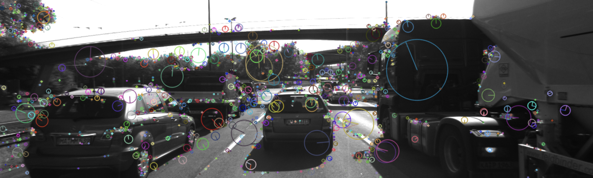

# 2D Feature Tracking

Benchmarking detector–descriptor combinations for camera-based collision detection, comparing keypoint yield, match rate and runtime across HARRIS, FAST, BRISK, ORB, AKAZE and SIFT.

Images are held in a fixed-size ring buffer so memory stays bounded regardless of sequence length.




## Results

Full benchmark across all detector–descriptor combinations is in [`results/`](results/). The three fastest combinations are all FAST-based. Runtime across the full set spans two orders of magnitude, and the highest-yield detectors are consistently the slowest:

| Detector | Descriptor | Matched Keypoints | Detection Time (ms) | Description Time (ms) |
|----------|-----------|--------------------|---------------------|-----------------------|
| FAST     | BRIEF     |         107        |        0.810        |        0.429          |
| FAST     | BRISK     |         80         |        0.850        |        1.673          |
| FAST     | ORB       |         96         |        0.917        |        1.419          |


## Conclusion
FAST is the detector choice: detection stays under 1 ms with matched keypoints consistently above 60. Other detectors ranged from 1.8 ms to 200 ms, with keypoint counts from 9 to 203 — and the high-yield detectors correlate strongly with high runtime, SIFT being the clearest example.

BRIEF is the descriptor choice, at minimum 3 ms faster than the alternatives. Across the ten fastest combinations, BRIEF appears five times, BRISK four and ORB once, with only 0.19 ms separating the ten.

FAST/BRIEF gave 0.81 ms detection and 0.43 ms description with 107 matched keypoints. It wasn't the outright fastest combination, but it returned 20 more keypoints than the next closest at comparable timing. Since the goal is tracking the preceding vehicle for TTC estimation, keypoint count directly bounds the accuracy of that calculation — so the right choice is the combination that maximises matches while staying inside a real-time budget, not the one that minimises time alone.


## Basic Build Instructions

1. Clone this repo.
2. Make a build directory in the top level directory: `mkdir build && cd build`
3. Compile: `cmake .. && make`
4. Run it: `./2D_feature_tracking`.

## Dependencies for Running Locally
1. cmake >= 2.8
 * All OSes: [click here for installation instructions](https://cmake.org/install/)

2. make >= 4.1 (Linux, Mac), 3.81 (Windows)
 * Linux: make is installed by default on most Linux distros
 * Mac: [install Xcode command line tools to get make](https://developer.apple.com/xcode/features/)
 * Windows: [Click here for installation instructions](http://gnuwin32.sourceforge.net/packages/make.htm)

3. OpenCV >= 4.1
 * All OSes: refer to the [official instructions](https://docs.opencv.org/master/df/d65/tutorial_table_of_content_introduction.html)
 * This must be compiled from source using the `-D OPENCV_ENABLE_NONFREE=ON` cmake flag for testing the SIFT and SURF detectors. If using [homebrew](https://brew.sh/): `$> brew install --build-from-source opencv` will install required dependencies and compile opencv with the `opencv_contrib` module by default (no need to set `-DOPENCV_ENABLE_NONFREE=ON` manually). 
 * The OpenCV 4.1.0 source code can be found [here](https://github.com/opencv/opencv/tree/4.1.0)

4. gcc/g++ >= 5.4
  * Linux: gcc / g++ is installed by default on most Linux distros
  * Mac: same deal as make - [install Xcode command line tools](https://developer.apple.com/xcode/features/)
  * Windows: recommend using either [MinGW-w64](http://mingw-w64.org/doku.php/start) or [Microsoft's VCPKG, a C++ package manager](https://docs.microsoft.com/en-us/cpp/build/install-vcpkg?view=msvc-160&tabs=windows). VCPKG maintains its own binary distributions of OpenCV and many other packages. To see what packages are available, type `vcpkg search` at the command prompt. For example, once you've _VCPKG_ installed, you can install _OpenCV 4.1_ with the command:
```bash
c:\vcpkg> vcpkg install opencv4[nonfree,contrib]:x64-windows
```
Then, add *C:\vcpkg\installed\x64-windows\bin* and *C:\vcpkg\installed\x64-windows\debug\bin* to your user's _PATH_ variable. Also, set the _CMake Toolchain File_ to *c:\vcpkg\scripts\buildsystems\vcpkg.cmake*.

---
Built on the starter framework from Udacity's Sensor Fusion Nanodegree.
